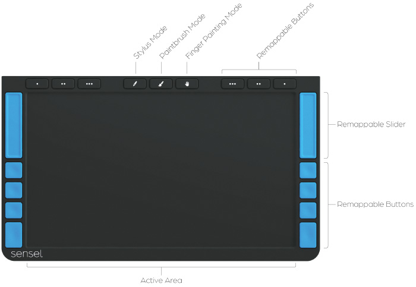
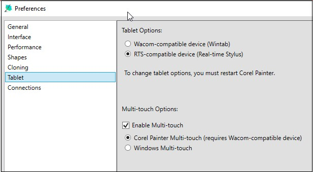
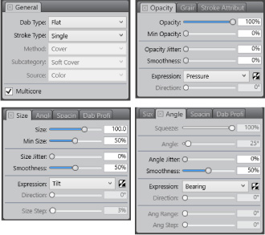
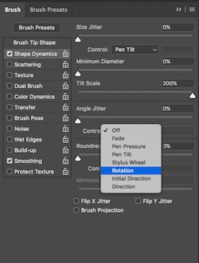
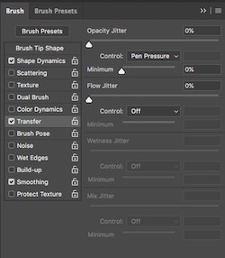
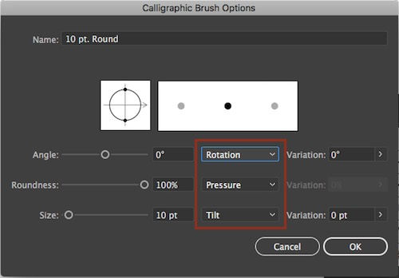
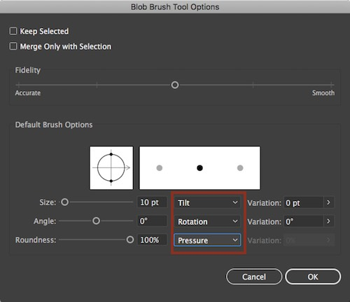
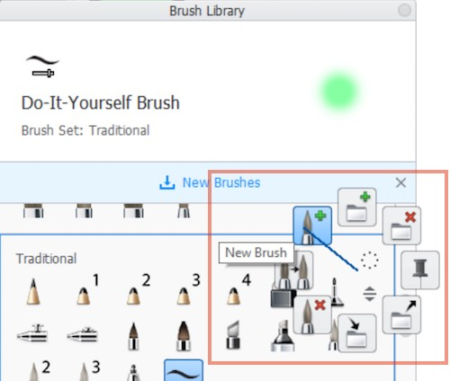
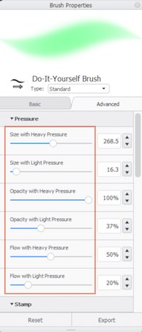

### Art

The Art overlay is more than just a new stylus. Offering several modes for drawing styles, tools, and methods, the Art overlay takes full advantage of the Morph’s powerful pressure sensors to give the visual artist new and old ways of creating digital drawings. 
Not only can the Art overlay enable the use of an arbitrary stylus (pen, pencil, chopstick, fingernail), but it also allows use of the “natural” artist tools: brushes, crayons, chalk, charcoal, and more. What's more, the Morph's 32,000 levels of pressure is vastly more sensitive than any other drawing tablet.

With the proper setup, your drawing software will adapt to brush size and orientation of the tool, letting instinct and muscle memory translate into great digital art.

#### Overview

When the Art Overlay is placed on the Morph, it shows up as a USB HID Graphics Tablet. You can press the “hand” button to immediately begin navigating your computer’s desktop and file folders. Once you open a graphics application, you can use the other modes to start creating. Any graphics software that accepts input from a stylus will work with the Art Overlay.
The top buttons stay out of the way of your drawing hand providing macros (the “dot” buttons) and mode selection.
The side buttons and slider add navigation and macro control. These are arranged symmetrically to allow for left or right hand artists. Normally, you would disable the side buttons on the dominant-hand side (to avoid an accidental trigger with a knuckle), and use the off-hand on the slider and buttons. 

#### Compatibility

* USB only.
* Mac OS 10.11 and below
* Windows 10

#### Don’t!

Don’t use a sharp object as a stylus. Silicon is prone to tearing and slicing, so you can easily damage the overlay with a sharp object. Retract your pens, and think twice about using a mechanical pencil directly on the overlay!

#### Modes

##### Pen Button - Pen Mode with Paper 
Pen mode lets you draw with real ball-point pens and graphite or colored pencils so you can use the medium and tools that feel most natural to you. Drawing on paper makes digital drawing easier to learn, since you can use the familiarity of paper to see where your strokes will be drawn, without the learning curve of most graphics tablets. For paper mode, it is wise to place two sheets of paper over the Art Overlay (a single thin sheet might let sharp pens poke through) and watch as your pen or pencil-strokes appear on the screen. The morph will act like a graphics tablet wherever it recognizes the pointy tip of a pen or pencil, so you can use it to draw in any standard drawing program. 

This mode features the Sensel Stylus Detection (a.k.a. “palm reject”) algorithm so you can rest your hand on the Morph while you draw. Paper Mode may work with a variety of drawing implements, as long as they have a relatively small and hard drawing tip. 

##### Pen Button - Pen Mode without Paper
This mode transforms the Morph into a drawing tablet. To enable paper-less drawing, check the "Use without paper" check-box in the Sensel App, and press the "Send Map to Morph" button. You can use any hard stylus-like objects such as the back of a pen or paintbrush, a retracted ball-point pen, or even a fingernail to draw using the Morph.  A light touch with the stylus will show a drawing cursor, so you can see where your stroke will begin. A harder force will start drawing the stroke. You can adjust the drawing force using the slider in the Sensel App.

##### Brush Button - Paint Mode
Paint mode brings the richness of physical media such as artists' charcoal, or conté crayons, brushes, or finger-smudging  to your drawing software. Paint mode lets you map the width, orientation, and pressure of your physical brush to properties of your digital brush. Since fingers and brushes can look much alike, this mode does not support palm rejection, so make sure not to rest your palm on the surface surface. Note that for soft brushes Paint Mode works better with no overlay on your Morph. You can set the default No Overlay mode to Paint Mode in the Sensel App. 

##### Hand Button - Gesture mode
Gesture mode lets you pan and zoom around your project using two finger swipe and pinch gestures. When using a single finger in this mode, the morph transforms into a giant trackpad, so you won't need to carry along a mouse to interact with your art software's GUI.

#### Buttons
All buttons are re-mappable with the SenselApp. Default behaviors provide popular controls and pan-zoom navigation.

* **Dots** - Defaults functions are cut, copy, paste.
* **Top Slider** - controls zoom level by default. You can use the SenselApp to re-map it to change brush size, transparency, or other continuous parameters.
* **Function Buttons** - are available for your most common functions. By default these three buttons are mapped to Option, Command and Undo (Command-Z) in macOS and Alt, Ctrl, and Undo (Ctrl-Z) in Windows.
* **Navigation Button** - is mapped to the spacebar for easy navigation in Adobe products.

#### Art Software Setups
The basic strategy behind setting up your software to work with the Morph is to understand what parameters come from the Morph and how to apply them to brush properties. In general, there are three dimensions that come from a USB stylus tablet: **Pressure**, **Tilt**, and **Rotation** (or Bearing). 

In Morph's unique Brush Mode, you want your software brush to adapt to the size of the brush or stylus you are applying to the Morph. This is reported on the "Tilt" channel, since traditional tablets use tilt to affect brush size. Pressure is best mapped to the brush opacity to emulate paint or ink density. Rotation is ideally mapped to brush angle when using software brushes that are non-round. 

Using the Stylus Mode, you can map Pressure and Rotation to your brushes, however, there is no Tilt reported from the Morph. 

##### Corel Painter
[Corel Painter](http://corel.com) offers a vast array of options for brushes, allowing for models of oils, gels, inks, charcoal, airbrush, and more. These settings are created in the Brushes Control Panel, which has several sub-tabs for the various properties. 

The first thing you'll need to do is make sure you have the correct tablet type selected in Corel's preferences. Go to the **Edit** menu and select **Preferences**, then select the **Tablet** panel. Make sure **"RTS-compatible Device"** is selected:

Now you are ready to modify your brushes. Open the Brush control panel from the **Window->Brushes Control Panels->General** menu, or use **CTL-b**. 
As an example, you can quickly set up a brush for Morph's brush mode using:
* Dab type: flat
* Opacity Expression to Pressure
* Size Expression to Tilt
* Angle Expression to Bearing

You may also want to refine the "feel" of your brush with the Brush Tracking curves. Go to **Edit->Preferences->Brush Tracking** and follow the instructions to make a brush feel natural.

##### Adobe Photoshop
[Adobe Photoshop](http://adobe.com/photoshop) of course goes beyond photo editing and provides several options for modelling different art media - airbrush, oils, watercolors, and more. 

Select the Brush tool from Photoshop's tools pallete:

Now you can open the Brush window from the Windows menu and use the Shape Dynamics and Transfer brush properties to apply the Morph's Pressure and Rotation to the brush:

Depending on the desired effect, pressure can be applied to Opacity or Flow. 

##### Adobe Illustrator
[Adobe Illustrator](http://adobe.com/illustrator)

Adobe Illustrator is a fully featured illustration program, with several different brush options and types. Depending on the chosen brush, there are different places to set up the Morph's Pressure, Rotation, and Tilt data. Below are screen caps of several places you can setup your Morph to interact directly with Brush properties. As you'll see, these options are generally found by double-clicking on the brush in the Brush Window.:

First, be aware that there are a couple different types of brush in Illustrator: the Paintbrush and the Blob Brush.

Brush selection happens in the Brush Library and Brushes windows. If the Paintbrush is selected (not Blob Brush), you can access the Brush Options from the Brush window hamburger menu:

[Adobe Illustrator](img/overlay_art_ai_brushes_opt.jpg)

Double clicking on the top brushes in the brush window opens up the Caligraphic Options:

Double clicking on an Art Brush in the brush window opens up Art Brush Options:

If the Blob Brush is selected in Illustrator's tools, double clicking on that will pull up some more options

##### Sketchbook Pro

For the most part, Sketchbook only responds to the Pressure and Tilt parameters from a tablet. You can create a new brush using the Circle menu in the Brush Library:

Then, double-click on the new brush (or an existing one), and modify its properties. In this example, the minimum and maximum values for size, opacity, and flow have been modified to respond to pressure. Set min and max to the same value to have the parameter unaffected by pressure.

Some brushes will respond to tilt, which the Morph uses to send stylus size in Brush Mode. You can use this parameter in some brushes to interesting effect:

<!-- 
Lightroom
GIMP
Manga Studio 
Clipstudio Paint
 -->
