# Welcome
This User Guide explains the Sensel Morph hardware, features, software and, most importantly, how to use it. This User Guide is maintained in its own [github repository](https://github.com/sensel/morph-docs). If you have suggestions, corrections, or improvements, you can [log an issue](https://github.com/sensel/morph-docs/issues) or even fix it yourself and [make a pull request](https://github.com/sensel/morph-docs/pulls).

## Overview - What is Morph?
The Sensel Morph is a multi-touch, pressure sensitive, and reconfigurable control surface for artists, musicians, coders, and other creative people. 

There are several different Overlays for the Morph - each provides a different interactive interface for different creative softwares. Simply remove the current overlay and put down a new one - the Morph reconfigures and adapts to the new task at hand - playing music, editing video, drawing,  playing games, or programming your own interface with the [Sensel API](api.md).

The Morph can be connected with USB or wirelessly via Bluetooth 4.0LE.

### Features
**Highly Sensitive**:

* Approx. 20,000 pressure sensors 5g - 5kg sensing range per touch (32,000 levels)

**Extremely Fast**:

* Full Resolution Mode: 125 Hz (8 ms latency)
* High Speed Mode: 500 Hz (2 ms latency)

**Precise Tracking**:

* 6502 dpi

**Versatile Connectivity**

* Bluetooth LE, USB, Serial (enabled with Innovator's Kit)

**On-the-Go Power**

* USB, Rechargeable Lithium Ion Polymer Battery

## What's in the box


* Morph
* 3ft. USB Micro Cable
* Carrying case
* Overlays<sup>[1](#spec-fn1)</sup>
* Quickstart guide
* FCC and CE compliance statement

<a name="spec-fn1">1</a> - Overlays received in your box depend on Overlays ordered.

## Supported Operating systems

| Operating system | USB MIDI | Bluetooth LE MIDI | SenselApp |
| -----------------|----------------|----------|-----------|
| Mac OS X/macOS 10.10 + |  Yes | Yes | Yes |
| Windows 7 and 8 | Yes | No | Yes |
| Windows 10 Anniversary Edition | Yes | Yes | Yes |
| Ubuntu/Debian-based Linux<sup>[1](#os-fn1)</sup> | Yes | [Soon](https://blog.felipetonello.com/2017/01/13/midi-over-bluetooth-low-energy-on-linux-finally-accepted/) | No |
| Android | Yes | Yes<sup>[2](#os-fn2)</sup> | No |
| iOS | Yes | Yes | No |

<a name="os-fn1">1</a> - Many linux distributions will support USB MIDI. Only distributions that use the [bluez](http://www.bluez.org/) stack will support BLE MIDI.

<a name="os-fn2">2</a> - Supported in Android Marshmallow and up

## Quick Start
This guide will help you get your Morph out of the box and working with your computer or mobile device.

### 1 Download Software
Download the SenselApp mapping and configuration application from [the Sensel website.](http://sensel.com/start) This is a great tool for getting the most out of your Morph, and essential for updating its firmware.

### 2 USB connection
1. Remove the Morph and the supplied USB Micro cable from the box.
1. Connect the Morph to your Windows or MacOS computer with the USB cable.
1. The Morph will power up and automatically connect to your operating system.

### 3 Update Firmware
Make sure you have a reliable internet connection and launch the Sensel App on your computer with the Morph connected. The application will query our servers and find out if there is a firmware update available. If there is an update available, update your firmware and continue.

### 4 Launch the Visualizer
The Visualizer is the easiest way to see activity on your Morph and confirm that the hardware is communicating with your computer.


### Turning On, Turning Off

* Turn the Morph off by holding the button down for a few seconds. When the red LED light goes off, release the button. If you release the button before the light goes off, the Morph will still be drawing power.
* The Morph will automatically turn on when connected to a USB host.
* If off, hold the button down for a second or so to turn on. Release when the LED light turns white (USB) or turns blue (wireless).
* If the Morph is plugged into USB, disconnecting from USB will turn power off.

## Hardware
At first glance, the Sensel Morph appears a fairly simple piece of hardware. It consists of a flat rectangular area of force-sensing circuitry, a slightly raised area that contains additional processing circuitry, LEDs, a button, and micro USB connector. This sleek hardware is actually quite powerful, as you’ll find out. 

### Features


### LEDS
There are two locations for LEDs on the Morph. The single LED on the top right corner of the device can show a variety of colors, and the LED strip which will always be white. 

#### Status RGB
This LED changes colors to indicate different statuses. The different color and blink patterns are as follows:

* _White_: Communication is happening to the device over USB
* _Blue stable_: The device is in bluetooth mode
* _Blue pulsing_: The device is in bluetooth pairing mode
* _Yellow_: The device is in update mode (this means you should open the Sensel App and update the firmware on your device)
* _Purple_: The device is communicating through the Developer's Cable (you won't see this unless you're using the Developer's Cable from the Innovator’s Kit)
* _Red_: Indicates a low battery or powering off device. To turn off the Morph, press and hold the power button for 5 seconds. After 2 seconds the red LED will turn on. Wait until the LED turns off before releasing the power button.

#### Strip
There is a strip of 24 white LEDs. These light up when areas are pressed on the Overlays and can be controlled with the API.

### Button
Use to power the device on/off and put in Bluetooth pairing mode.

* Press to turn on
* Hold for a few seconds to put in pairing mode (blue pulsing LED)
* Hold for a few seconds to turn off (wait for red LED to go off)
* Double click to disconnect from current device and put Morph in pairing mode

### USB Connector
The Morph has a single USB micro connector for charging the battery and providing a serial connection.

### Bluetooth Transmitter
The Morph can seamlessly switch between Bluetooth and wired operation. [Read on](#bluetooth-connection) for details on connecting to your device with Bluetooth.

### Force Sensor Surface
<!-- With no Overlay, the Morph acts as a giant touch sensitive track pad for your computer. -->
Without an Overlay, the force sensing surface can be used with the [Visualizer](#visualizer) in the Sensel App to view pressure levels and contact regions. It is no more or less durable than the rest of the case.

### Battery Life
The Morph has a built-in rechargeable 3.7 volt Lithium Ion Polymer battery rated at 420 mAh.

### Care and Feeding

The Overlays are made of silicone rubber with a silicone top-coating for a smooth feel. You can clean them with warm water and soap. While we have tested a variety of substances to ensure quality, it is known that some sunscreens and lotions can be contaminants to plastics. So, to ensure longest life for your Overlays, try not to use Overlays when your hands have excess lotion or sunscreen on them. Additionally, silicone is susceptible to tears. Once torn, it's difficult to stop. Use the handy case we provide to keep your Overlays away from loose change, hairpins, keys, or other sharp items!

The LiPo battery's charge is handled by the Morph's internal electronics. However, a general rule-of-thumb for LiPo batteries is that they should not be stored at full charge. If you will not be using the Morph for a while, turn it __on__ and let the battery charge down.

The black surface of the pressure sensor is made of durable PET (Polyethylene Terephthalate) plastic.

### Dimensions
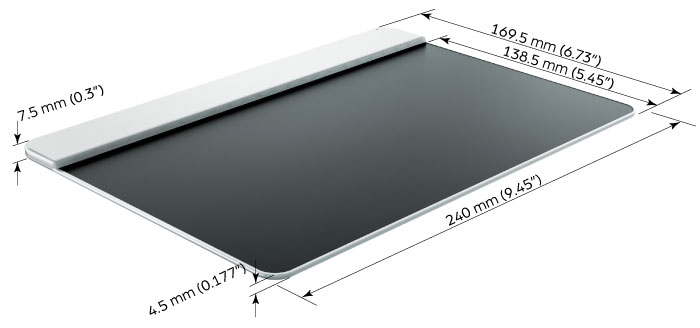

Thickness measurements are with the rubber feet. Subtract 0.75 mm for thickness measurements without the rubber feet.

## SenselApp Software
The Sensel App is used to flash firmware, configure, calibrate, and confirm the functions of the Morph. You can also use it to customize and re-map button functionality on your Overlays. Download the software for Windows or macOS from the [Sensel website](http://sensel.com/start).

In order to use any of the features in the Sensel App, you'll need to have a wired connection between your Morph and computer. A wireless connection is not sufficient for working with the Sensel App.

### Home
The home page of the Sensel App allows you to select a task. You can edit the output of Overlays, update firmware, and visualize the raw data from pressure input on the Morph.


### Icons
You'll notice 2-3 icons in the bottom right of the application window. Here's what they mean:

*  - active wifi connection for updating app and firmware
*  - active usb connection with Morph
*  - load help for app

If there's a red circle and slash, it means the connection is inactive or broken. If you have the Morph connected via USB and you see a red circle/slash over the USB icon, double check your USB connection or try a different cable.

### Overlay Mapper

#### Music Overlays


The Music Production, Drum, and Piano Overlays can be completely modified from their default settings to work however you’d like them to.

When you select a music Overlay from the Sensel App, you'll open a screen where you can click on the different buttons or regions to modify the MIDI notes sent from the pads. 

Use the inspector's menu to select a different note value for each pad you want to change. You can save the settings to a map preset. 

When finished editing, be sure to click "Send Map to Morph" to modify the settings.

#### QWERTY (+ AZERTY and DVORAK) Overlay


In a way, the mapper for the QWERTY Overlay is very similar to the music editors. However, instead of modifying MIDI notes, you are modifying the key event codes from each stroke. A list of keyboard codes can be found at [this link.](https://en.wikipedia.org/wiki/ASCII#Code_chart)

<!-- More importantly, the QWERTY Overlay mapper allows you to set the operating system preference, which impacts how the control, option, command, and function keys will behave on the Overlay. Use the menu to set your preference and click "Send to Morph". -->

##### Set Keyboard Layout
The Morph will detect the Overlay attached to the device, but you will need to change the desired layout for each computer or smartphone. Following are some external links to guides (and opinions) on changing your keyboard layout for different operating systems:

* [Windows 10](http://www.windowscentral.com/how-change-your-keyboard-layout-windows-10)
* [macOS](http://atmac.org/dvorak-keyboard-layouts-easier-on-the-fingers)
* [Ubuntu](http://www.wikihow.com/Change-Keyboard-Layout-in-Ubuntu)
* [Android](https://rietta.com/blog/2013/09/20/is-the-colemak-or-dvorak-keyboard-layout-best-for-you/)
* [iOS](https://www.igeeksblog.com/how-to-change-keyboard-layout-on-iphone-and-ipad/)

#### Gamepad Overlay
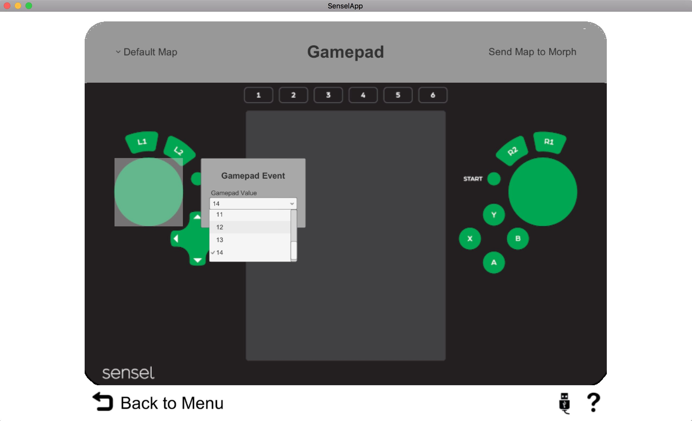

Some games support HID gamepad events without any emulation, but do not let you customize the button values in the game. As a result, the controller might work, but the buttons all do the wrong thing! The Sensel App lets you change the HID gamepad value for each button of the Gamepad Overlay so the controls can match the gameplay.

### Visualizer

Use the Visualizer to view the raw pressure information coming from the Morph's sensor. The visualizer is more than entertaining, it's a look behind the scenes of what happens when you are using the Morph. 

You can see the effects of using different materials between a stylus (or some other actuator, like a finger) and pressure surface. You can even see that very sharp styli won't generate much of a pressure reading, and benefit greatly from a material or overlay. 

The curious and creative user will find great satisfaction in the Visualizer!

## Overlays

### QWERTY


The QWERTY Overlay works like a regular QWERTY keyboard. It's great for using the Morph as a keyboard for iPads and other tablets. You will need to configure it for your Operating System using the Sensel App.

The [AZERTY](https://en.wikipedia.org/wiki/AZERTY) and [DVORAK](https://en.wikipedia.org/wiki/Dvorak_Simplified_Keyboard) Overlays provide access to more internationally-used keyboard layouts.

### Piano


The Piano Overlay sends MIDI data on Channel 1 from the Morph to your device so you can play software synths and samplers. By default, the Piano Overlay sends notes on MIDI channel 1 and the default octave starts at note 60 (C3<sup>[1](#piano-fn1)</sup>). You can transpose up and down two octaves with the arrow keys. Additionally, you can create vibrato by moving your fingers side-to-side, bending the note.

The play, stop, and record buttons send MIDI Machine Control (MMC) commands to enable those features. Some software products, such as Ableton Live, do not recognize MMC, so they will seem to not work in those cases.

Since there is no standard MMC message for "loop," the loop button sends a MIDI note, allowing you to use software MIDI latch (or learn) to use it to control the Loop function in your software.

<a name="piano-fn1">1</a> - MIDI notes conventionally start at note number 0, named C-2. This is not a standard, as this convention has been broken many times, but most music software today tends to call MIDI note 60 C3. 

### Drums


The Drum Overlay sends notes on MIDI Channel 10. The Default notes start at 36 (C3). The arrow keys transpose all notes up or down 16 semitones to better work with many software drum machines, which work in banks of 16 notes.

The play, stop, and record buttons send MIDI Machine Control (MMC) commands to enable those features. Some software products, such as Ableton Live, do not recognize MMC, so they will seem to not work in those cases.

### Music Production


The 16 Pad grid sends on MIDI Channel 2, the controls send on MIDI Channel 2, the "piano keys" send on MIDI Channel 3.

The play, stop, and record buttons send MIDI Machine Control (MMC) commands to enable those features. Some software products, such as Ableton Live, do not recognize MMC, so they will seem to not work in those cases.

### Gaming


The Gaming Overlay converts the Morph into a game controller. Based on popular controllers, the Gaming Overlay has all the controls you need to play games.

The Gamepad Overlay sends standard Human Interface Device (HID) gamepad events to your computer or smartphone. While most _devices_ support this standard, not every _game_ does. To bridge this gap, emulators can be used to change HID gamepad events to events that the game can understand, such as XBox controller, Playstation Dualshock, or keyboard events.

#### Customizing

If the buttons on the overlay don't perform the right action in the game, use the [SenselApp](#gamepad-overlay) to customize the event values.

#### Emulating

For other cases, you can use software to emulate controllers.

##### Windows

USB Game Controller - comes with Windows 10. Open the USB Game Controller in Windows,  select "Sensel Morph" and click "Properties" to see the available buttons and joysticks. 

[TocaEdit Xbox 360 Controller Emulator](http://www.x360ce.com/) - software lets a controller emulate an Xbox 360 controller and customize gamepad events. [Download](files/x360ce.ini.zip) our mapping file. Unzip and put this map and the `x360ce.exe` executable file in the same directory as the game executable. 

##### macOS
The emulator [Enjoyable](https://yukkurigames.com/enjoyable/) maps HID events to joystick for game control compatibility.

##### Browsers
Some browsers support gamepad input using the Gamepad API. Gamepad support can be found on the [Can I Use website](http://caniuse.com/#feat=gamepad)

##### Bluetooth
Gamepad-over-Bluetooth will be supported in future releases.

### Media Editing
The Media Editing Overlay is used for editing video and sound.

### Art


Use the Art Overlay as a high-resolution drawing interface to capture the finest strokes with a variety of brushes and styli. You can use it to create digital art with your fingers, pen and pencil over paper, paint brushes, and any other tools you’d like.

### Innovator
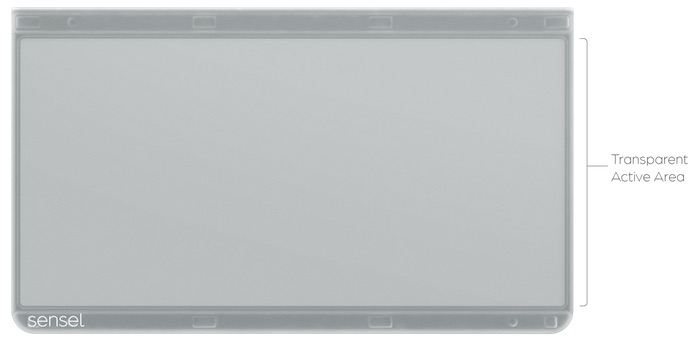

Your turn to make an Overlay! The Innovator's Kit works with the API. Included in the Kit is a simple UART cable which turns the microUSB port on the Morph into a UART connection for microcontrollers.

## Bluetooth connection
The Sensel Morph is a Bluetooth 4.0 LE wireless device. This means it can function as a wireless controller for your music, drawing, or writing.
This section describes how to pair and un-pair your Morph to a bluetooth connection on a number of operating systems. Once the Morph is paired to your device, it will automatically connect when in range.

### Pairing

In general, the process is as follows. Screen images for different operating systems are below.

* Unplug the Morph from any USB computer connection.
* Open the bluetooth control panel for your computer.
* Hold the button down for about one second. The Morph LEDs will flash and a blue LED will turn on after three seconds.
* Click the "pair" button in your computer's control panel.
* The Morph will be paired to your device.

### Unpairing

Currently, the Morph can be paired with only one device. If you want to pair the Morph to a different device, you'll need to unpair the connected device and the Morph.

* Turn off the Morph
* Unpair or forget the Morph from the previously connected device.
* Unplug the Morph from any USB computer connection.
* Open the bluetooth control panel for the new computer.
* Hold the button down for about one second. The Morph LEDs will flash and a blue LED will turn on after three seconds.

### Switch Pairing

Once you have un-paired the Morph, you don’t need to power down and up again to pair to a different device.

* Double click the power button. The Morph lights should flash again and the blue LED will turn on after three seconds.
* Click the "pair" button in your new computer's control panel.
* The Morph will be paired to your new device.

### OS Specific Pairing Guides

Connection guides for macOS, Windows, and Linux follow.

#### macOS
Open System Preferences and click the Bluetooth icon.
Put the Morph into pairing mode. The control panel will look like:


Click the "pair" button on screen. Your Morph is now paired:


#### Windows
Open the Settings panel for Bluetooth. The easy to get there is to use the Windows search bar:

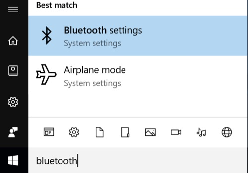

Windows will find the Morph as ready to pair:

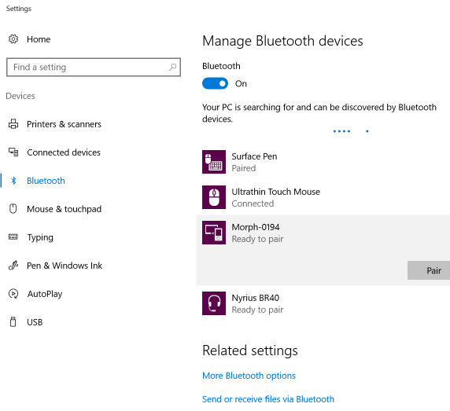

Double click the Morph listing and it will connect:

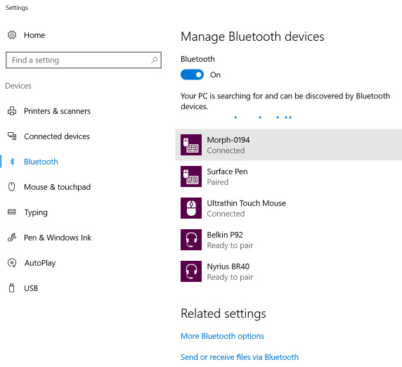

#### iOS
Open Settings and select Bluetooth. Put the Morph into pairing mode. Select Morph in the available devices and pair.

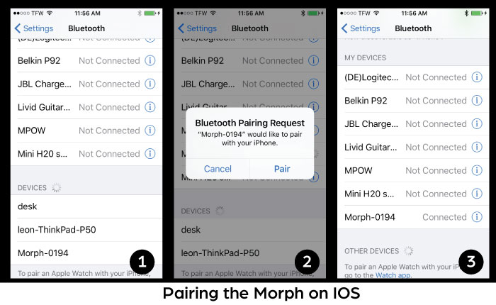

Once you have paired with the Morph, you will be able to use it with the different Overlays. Here are some sample screen captures of how it shows up  in different apps:


#### Android
Put the Morph into pairing mode. In Android's Settings app, select Bluetooth, select "Morph" from the available devices and pair:


Once paired, you can use the Morph. If you are using the QWERTY Overlay, you'll probably want to setup your keyboard so you can easily switch between on-screen and Morph. Use the keyboard icon on the bottom of your screen:


#### Linux
There are many flavors of Linux. We are documenting one of the most common, Ubuntu 16.04. Open the Settings panel and select the Bluetooth panel

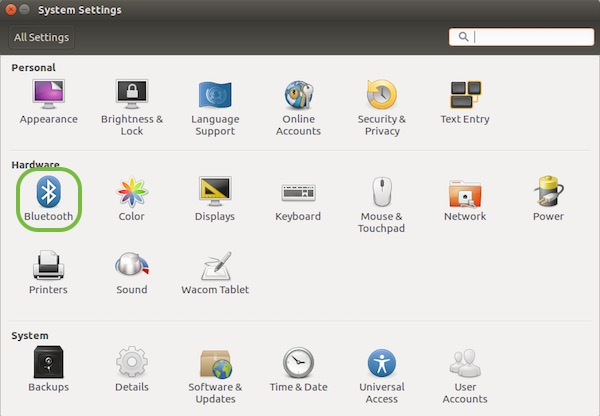

In the lower left of the "Devices" panel, click the "*+*" button to search and add the Morph.

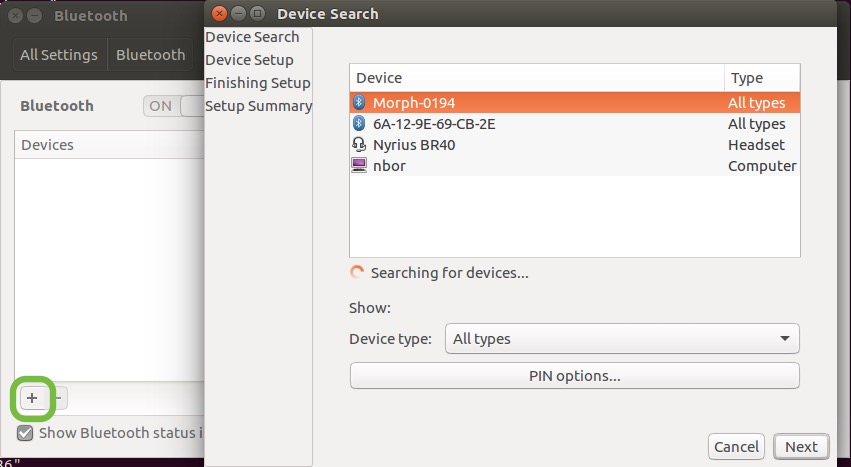

Most Linux relies on the bluez bluetooth stack. You can also use the command line tools to pair. Once you run the `bluetoothctl devices` command, you'll be in the bluetoothctl interactive shell:

```
> bluetoothctl devices
[NEW] Controller 00:15:83:3D:0A:57 sensoruser [default]
[NEW] Device 71:11:32:B0:12:A0 Morph-0194
[bluetooth]# pair 71:11:32:B0:12:A0
[bluetooth]# pair 71:11:32:B0:12:A0
[bluetooth]# connect 71:11:32:B0:12:A0
[bluetooth]# trust 71:11:32:B0:12:A0
```
If you want to disconnect, you can
```
bluetoothctl remove 71:11:32:B0:12:A0
```
##### Update bluez
If you want to update to the latest bluez software, you can get the link from the [bluez site](http://www.bluez.org/download/). At the time of writing, the current version is 5.44. This has some support for Bluetooth MIDI:
```
sudo apt-get update
sudo apt-get install -y libusb-dev libdbus-1-dev libglib2.0-dev libudev-dev libical-dev
cd ~/Downloads
wget http://www.kernel.org/pub/linux/bluetooth/bluez-5.44.tar.xz
tar xvf bluez-5.44.tar.xz
cd bluez-5.44
./configure
make
sudo make install
```

While we can't explicitly support all Linux, this should at least get you started.

#### Bluetooth MIDI configuration
If your operating system supports MIDI over Bluetooth, you can have a wireless MIDI controller.

##### macOS
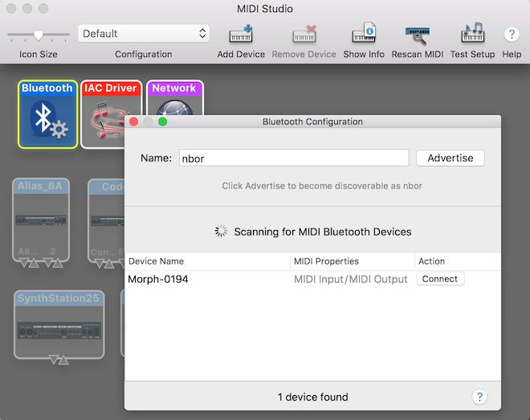

Open the AudioMIDI application in macOS. Open the MIDI Studio window (cmd-2) and double-click the Bluetooth logo. If you have successfully [paired the Morph with Bluetooth](#os-specific-pairing-guides), you'll see your device listed here. Press "connect" and the Morph will be available to any MIDI applications as an input device.

##### Windows
Windows 10 Anniversary Edition and after support Bluetooth MIDI, so make sure you have the latest update. This support, however, is limited to applications that use the UWP MIDI API (or the Win32 wrapper for UWP MIDI) (read more details [here](https://blogs.windows.com/buildingapps/2016/09/21/midi-enhancements-in-windows-10/#azm4tjkjLF8sj0el.97)). As a result, for common use, you might need a couple additional pieces of software:

* [MIDIberry](https://www.microsoft.com/en-us/store/p/midiberry/9n39720h2m05)
* [loopMIDI](https://www.tobias-erichsen.de/software/loopmidi.html)

The loopMIDI application creates virtual (or **loopback**) MIDI ports. MIDI berry provides a connection between the Morph's Bluetooth MIDI ports and the virtual MIDI ports. In your music application, you connect to the virtual port created in loopMIDI. Screenshot examples below show loopMIDI with the virtual port, MIDIberry with the connection made, and a couple of applications using the vitrual port to get MIDI input from the Morph.

* virtual port "MorphMIDI Port" created in loopMIDI (type in the field, then click "+")


* connection between Morph bluetooth and "MorphMIDI Port" made in MIDIberry (just tap on an input port and an output port to connect them)


* virtual port "MorphMIDI Port" selected in the MIDI setup prefs of Bitwig Studio
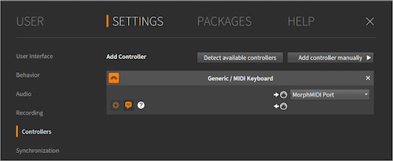

* virtual port "MorphMIDI Port" selected in the MIDI setup prefs of FL Studio


##### iOS
iOS version 8 and above support Bluetooth MIDI. These devices have Bluetooth LE support:

* iPhone 4s +
* iPad3 +
* iPad Mini +

Once the Morph is paired with the iOS device, it's available as a MIDI device to most iOS MIDI-capable apps. You'll need to go into an app's preferences or setup panel to enable and configure MIDI control.

In some cases, you may need the [midimittr app](https://itunes.apple.com/us/app/midimittr/id925495245?mt=8) to create a connection with the Morph which will expose the Morph's MIDI input to other apps.

##### Android
Android version [Marshmallow (6) and above](https://www.midi.org/articles/android-midi-in-marshmallow) support BLE MIDI. However, some devices support this connection type, and some don't. The best way to find out is to pair your device with the Morph via Bluetooth, then use the free [MIDI BLE Connect](https://play.google.com/store/apps/details?id=com.mobileer.example.midibtlepairing&hl=en) app from the Google Play store. Open it after paring the Morph to your Android device. If there is a connection to be found, MIDI BLE Connect will scan and find it.

##### Linux
BLE MIDI has some support in the latest [bluez](http://www.bluez.org) stack, and should have more complete support in future updates according to [this blog](https://blog.felipetonello.com/2017/01/13/midi-over-bluetooth-low-energy-on-linux-finally-accepted/). You are welcome to experiment! Instructions for updating to the most recently release of bluez are [above](#update-bluez).

## Use it!
As the name implies, there are a lot of different ways to use the high-resolution sensor that is the Morph. What follows in this section are the nuts and bolts on getting your morph working with your device and making use of the different Overlays in different softwares.

### Test it!
Because the Morph is capable of so many different modes and protocols, you may need some reassurance and ways of testing. Here's some tools and suggestions for some of the different modes.

#### MIDI
If you are unsure that your Morph is properly connected and providing MIDI input to your computer, you can test with some simple programs. If you don't know what MIDI is, it's a simple serial protocol that electronic music hardware and software uses to interoperate. Learn more [at wikipedia](https://en.wikipedia.org/wiki/MIDI).

##### macOS
* [MIDI Monitor](https://www.snoize.com/MIDIMonitor/)

##### Windows
* [MIDIberry](https://www.microsoft.com/en-us/store/p/midiberry/9n39720h2m05)

Bluetooth MIDI is available on Windows 10 Anniversary Edition, so make sure your version of Windows 10 is recently updated. It is limited to apps that use the native Windows MIDI implementation, so it probably won't show up as a MIDI input in most software.

MIDIberry provides native MIDI hooks to Windows 10, so it can connect to the USB MIDI and the Bluetooth MIDI ports created by the Morph. MIDIberry provides a monitor function that makes it easy to confirm MIDI data input from the Morph.

##### iOS
* [MIDI Wrench](https://www.crudebyte.com/mobile/midi_wrench/)

##### Android
* [USB MIDI Monitor](https://play.google.com/store/apps/details?id=com.extreamsd.usbmidimonitor&hl=en)

##### Linux
* [amidi](https://linux.die.net/man/1/amidi)
* [others](https://freesoftwaremusic.wordpress.com/2015/03/29/midi-monitors/comment-page-1/)

If you want a GUI monitor, you can find something in the "others" link above.
The easiest way to test on Linux is to use ALSA's `amidi` in a terminal. Plug in the Morph to your computer's USB port, then list the MIDI devices with:
```
amidi -l
```
You'll get something like
```
Dir	Device		Name
IO	hw:1,0,0 	Sensel Morph MIDI 1
```
Armed with the portname, you can now start dumping MIDI input to the terminal:
```
amidi -d -p hw:1,0,0
```

#### QWERTY
Open text editor or word processing program. Try typing. Use command and option keys. Everything work? If not, you'll need to either check your connection, or use the Sensel App to make sure your QWERTY Overlay is configured for your OS.

### Music Software Guides
For the most part, when the Morph is used as a MIDI device, it shows up like any other MIDI keyboard or controller. However, there are some details worth documenting, since, with default mappings, each Overlay sends on a different channel. Before you proceed make sure you have a wired or wireless connection between your device and the Morph.

The below screenshots show the Morph used as a Bluetooth MIDI device, but the general instructions do not change for the wired case or for different operating systems.

#### Ableton Live


Open the Preferences window in Ableton Live and select the MIDI tab. If you just want to play the keyboard and drums, turn "Track" on for the input port. If you want to use controls and buttons for parameters and switches in Live, turn "Remote" on for the input port. At this time, there is no MIDI control of the Morph, so there is no need to activate "Track" or "Remote" for output.

In Ableton Live, you can filter MIDI input on tracks according to Channel. You may want to do this to ensure different Overlays are dedicated to different tracks.

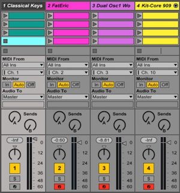

#### Bitwig Studio


Open the Preferences window in Bitwig Studio and select the Settings, then Controllers tabs. Select "Generic" (though the Morph is anything but generic!), then choose either "MIDI Keyboard" or "Keyboard + 8 Device Knobs".

The *MIDI Keyboard* option makes it easy to play notes in any of the instruments. If you want to map the extra CC controls of the Music Production Overlay to different parameters in Bitwig, you can use Bitwig's MIDI learn feature in the Mappings Browser Panel.

The *Keyboard + 8 Device Knobs* will make the Music Production Overlay nicer to work with. You can use the Sensel App to remap the knobs to CC values 20-27, and Bitwig will automatically map the eight knobs to the currently selected Device Macros.

In this setup, both options have been added as Controllers, though only one is active.


Note that it is not possible to filter MIDI Channels in Bitwig tracks. If you want to do more advanced filtering and controls, you can use Bitwig's Controller Scripting API and create a control script.

#### FL Studio
FL Studio is Windows-only, with a macOS alpha in the works.


Open the MIDI Settings window from the Options menu.

Select the Morph in the input panel.

Click "enable" below the Input panel. Select a controller type "(generic controller)" from the menu.

This enables basic MIDI input for the Morph. You can get more info on using MIDI in FL Studio 12 from their documentation.

#### Cycling 74 Max


Max will use any active MIDI device as an input. How you program your patch will affect what happens. The above screenshot illustrates the MIDI input selection menu that appears from double clicking on the MIDI input objects (midiin, ctlin, notein, pgmin, etc.).

#### Apple Logic Pro X, Garage Band, and Main Stage


With Apple music applications, "it just works" is the general idea. If it shows up in AudioMIDI Setup, it will provide input to recording-armed tracks to play software synths, samplers, and drums.

If you want to add more controls for effects and synths, you can use Logic's "Learn Controls" features.


You may need to edit some values in the Expert View, since sometimes Logic will guess incorrectly about the format of incoming data. The procedure is similar for Main Stage.

In some cases, you may want to exclude CC data from the after-pressure on the Music Production pads. For example, some synths may respond in undesirable ways to the CC data from the Pads. If you want Logic to ignore the CC data, go to the File->Project Settings->MIDI window and select the Input Filter tab. Here, you can select "Control Changes" to filter out any CC data from the Morph to Logic. This is a somewhat temporary fix, since this will keep the "dials" and sliders on the Music Production Overlay from working. Future firmware updates for the Morph will address this problem more elegantly.

Garage Band offers no remote control of parameters from MIDI devices. You can only play instruments with note and pitchbend input.

#### Presonus StudioOne 2


Open the Presonus preferences panel and select the *External Devices* tab. Press the _"Add..."_ button to add a new MIDI controller.


In the resulting *Edit Device* panel, you can add "Sensel" to the Manufacturer field and "Morph" to "Device Name" field. Press the _All_ button to receive MIDI on all channels. Select the Morph in the "Receive From" menu (there is no need to select the Morph in the Send To menu, since there is currently no MIDI control of the Morph).

Engage "Split Channels" if you would like to create a separate Instrument Track input for each MIDI channel from the Keyboard. You will probably want to enable Split Channels as pictured, since each Overlay sends on a different MIDI channel.

You can choose to use this Keyboard as your "Default Instrument Input" by checking the appropriate box. If you are using only one Keyboard with Studio One, you should check this box.

#### Propellerheads Reason
Reason has several ways of using a MIDI keyboard or controller. The most basic is to just add the Morph as a keyboard.

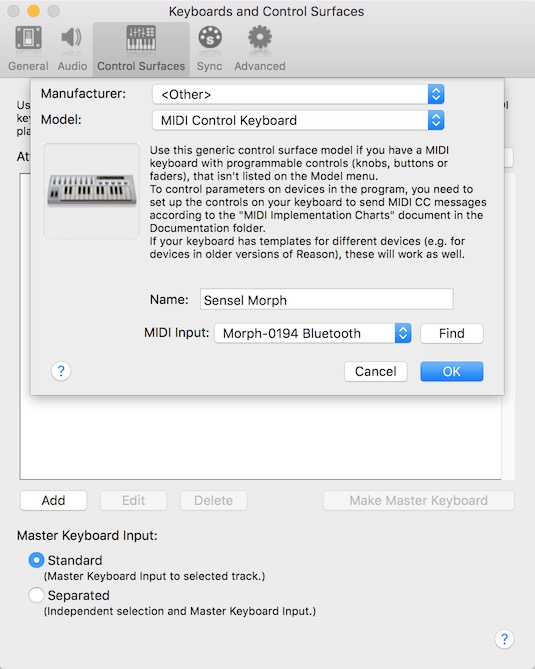

Open Reason's Preferences panel, and select the *Control Surfaces* tab. Click the _Add_ button, and select the "<Other>" from the *Manufacturer* menu and "MIDI Control Keyboard" from the *Model* menu. You can type "Sensel Morph" into the *Name* field. Finally, select the Morph from the *MIDI Input* menu.


After you have set that up, you can make a more sophisticated setup to filter channels

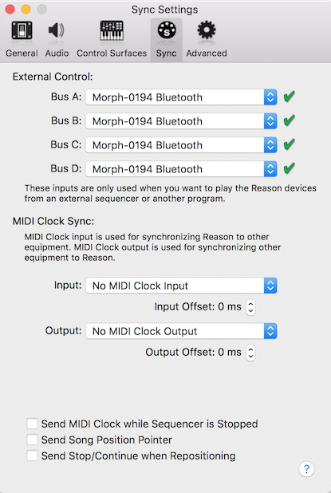

Select the "Sync" tab and add the Sensel Morph to at least one of the External Control Buses, as pictured above.


Now you can use the Hardware device in the Reason Rack and click the *ADVANCED MIDI* button to expose the selectors. It is here that you can map MIDI channels (and thereby different Overlays) from the Morph to different devices in your rack.

## API
There's a software API for Python, Processing, and C/C++. Find out more [at our github](http://github.com/sensel).
