# Welcome
This documentation explains the Sensel Morph hardware, features, software, and, most importantly, how to use it. These docs are maintained in its own [github repo](https://github.com/sensel/morph-docs). If you have a suggestion, correction, or improvement, you can clone this repo and [make a pull request](https://github.com/sensel/morph-docs/pulls) or [log an issue](https://github.com/sensel/morph-docs/issues).

## Overview - What is Morph?
The Sensel Morph is a reconfigurable control surface for artists, musicians, coders, and creative people of all stripes. It can work using Bluetooth 4.0LE or USB connections.

### Features
**Highly Sensitive**:

* Approx. 20,000 pressure sensors 5g - 5kg sensing range per touch (32,000 levels)

**Extremely Fast**:

* Full Resolution Mode: 125 Hz (8 ms latency)
* High Speed Mode: 500 Hz (2 ms latency)

**Precise Tracking**:

* 6502 dpi

**Versatile Connectivity**

* Bluetooth LE, USB, Serial (enabled with Innovator's Kit)

**On-the-Go Power**

* USB, Rechargeable Battery

## What's in the box
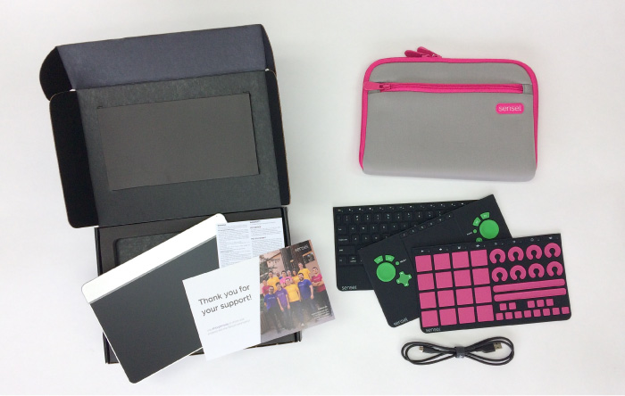

* Morph
* 3ft. USB Micro Cable
* Carrying case
* Overlays<sup>[1](#spec-fn1)</sup>
* Quickstart guide
* FCC and CE compliance statement

<a name="spec-fn1">1</a> - Overlays received in your box depend on overlays ordered.
## Supported Operating systems

| Operating system | USB MIDI | Bluetooth LE MIDI | SenselApp |
| -----------------|----------------|----------|-----------|
| OS X 10.10 + | Yes | Yes | Yes |
| macOS 10.12 + |  Yes | Yes | Yes |
| Windows XP, 7, and 8 | Yes | Yes | Yes |
| Windows 10 Anniversary Edition | Yes | Yes | Yes |
| Ubuntu/Debian-based Linux<sup>[1](#os-fn1)</sup> | Yes | [Soon](https://blog.felipetonello.com/2017/01/13/midi-over-bluetooth-low-energy-on-linux-finally-accepted/) | No |
| Android | Yes | Yes<sup>[2](#os-fn2)</sup> | No |
| iOS | Yes | Yes | No |

<a name="os-fn1">1</a> - Many linux distributions will support USB MIDI. Only distributions that use the [bluesz](http://www.bluez.org/) stack will support BLE MIDI.

<a name="os-fn2">2</a> - Supported in Android Marshmallow and up

## Quick Start
This guide will get your Morph out of the box and working with your computer or mobile device.

### 1 Download Software
Download the SenselApp mapping and configuration application from [the Sensel website.](http://sensel.com/start) This is not only a great tool for getting the most out of your Morph, but essential for updating its firmware.

### 2 USB connection
1. Remove the Morph and the supplied USB Micro cable from the box.
1. Connect the Morph to your Windows or MacOS computer with the USB cable.
1. The Morph will power up and automatically connect to your operating system.

### 3 Update Firmware
Make sure you have a reliable internet connection and launch the Morph Dashboard on your computer with the Morph connected. The application will query our servers and find if there is a firmware update available. If there is, update your firmware and continue.

### 4 Launch the Visualizer
The Visualizer is the easiest way to see activity on your Morph and confirm the hardware is communicating with your computer.


## Bluetooth connection
The Sensel Morph is a Bluetooth 4.0 LE wireless device. This means it can function as a wireless controller for your music, drawing, or writing.
This section describes how to pair and un-pair your Morph to a bluetooth connection on a number of operating systems. Once the Morph is paired to your device, it will automatically connect when in range.

### Pairing mode

In general, the process is as follows. Screen images for different operating systems are below.

* Unplug the Morph from any USB computer connection (power connection is OK).
* Open the bluetooth control panel for your computer.
* Hold the button down for about four seconds, or until the LED turns blue.
* Click the "pair" button in your computer's control panel.
* The Morph will be paired to your device.

### Unpairing
If you want to pair the Morph to a different device, you'll need to unpair it from any current connection.
The best way to do this is to turn Bluetooth off on the device the Morph is currently connected to. Now, make sure Bluetooth is on for the different device, then go through the pairing process.

### Swap Pairing
Now that the Morph has been paired to two different devices, it's very easy to swap connections.
Simply double-click the button on the Morph and it disconnect from your current device, then will connect to the other device.

(TKTK - *there is still a bit of mystery here* )

### OS Specific Pairing Guides

#### OSX
Open System Preferences and click the Bluetooth icon.
Put the Morph into pairing mode. The control panel will look like:


Click the "pair" button on screen. Your Morph is now paired:


#### Windows
Open the Settings panel for Bluetooth. The easy to get there is to use the Windows search bar:


#### iOS
Open Settings and select Bluetooth. Put the Morph into pairing mode. Select Morph in the available devices and pair.


Once you have paired with the Morph, you will be able to use it with the different overlays. Here are some sample screen captures of how it shows up  in different apps:

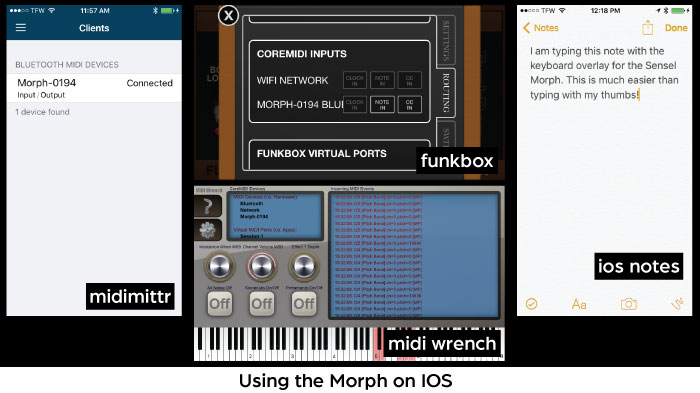

#### Android
Put the Morph into pairing mode. In Android's Settings app, select Bluetooth, select "Morph" from the available devices and pair:

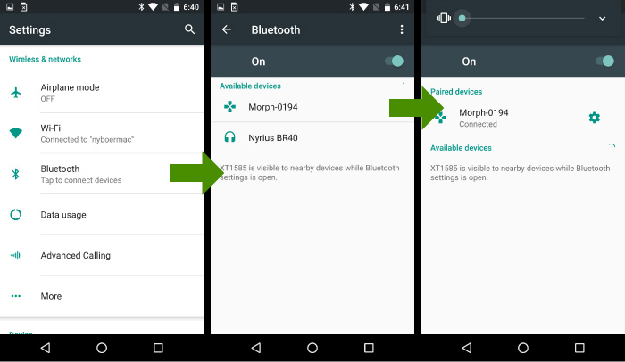

Once paired, you can use the Morph. If you are using the QWERTY overlay, you'll probably want to setup your keyboard so you can easily switch between on-screen and Morph. Use the keyboard icon on the bottom of your screen:

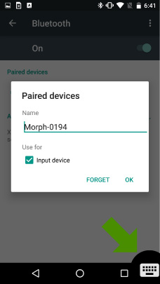

#### Linux
There are many flavors of Linux. We are documenting one of the most common, Ubuntu 16.04. Open the Settings panel and select the Bluetooth panel


In the lower left of the "Devices" panel, click the "*+*" button to search and add the Morph.


Most Linux relies on the bluez bluetooth stack. You can also use the command line tools to pair. Once you run the `bluetoothctl devices` command, you'll be in the bluetoothclt interactive shell:

```
> bluetoothctl devices
[NEW] Controller 00:15:83:3D:0A:57 sensoruser [default]
[NEW] Device 71:11:32:B0:12:A0 Morph-0194
[bluetooth]# pair 71:11:32:B0:12:A0
[bluetooth]# pair 71:11:32:B0:12:A0
[bluetooth]# connect 71:11:32:B0:12:A0
[bluetooth]# trust 71:11:32:B0:12:A0
```
If you want to disconnect, you can 
```
bluetoothctl remove 71:11:32:B0:12:A0
```
##### Update bluesz
If you want to update to the latest bluez software, you can get the link from the [bluez site](http://www.bluez.org/download/). At the time of writing, the current version is 5.44. This has some support for Bluetooth MIDI:
```
sudo apt-get update
sudo apt-get install -y libusb-dev libdbus-1-dev libglib2.0-dev libudev-dev libical-dev 
cd ~/Downloads
wget http://www.kernel.org/pub/linux/bluetooth/bluez-5.44.tar.xz
tar xvf bluez-5.44.tar.xz
cd bluez-5.44
./configure
make
sudo make install
```

While we can't explicitly support all Linux, this should at least get you started. 

#### Bluetooth MIDI configuration
If your operating system supports MIDI over Bluetooth, you can have a wireless MIDI controller.

##### OSX


Open the AudioMIDI application in macOS. Open the MIDI Studio window (cmd-2) and double-click the Bluetooth logo. If you have successfully [paired the Morph with Bluetooth](#os-specific-pairing-guides), you'll see your device listed here. Press "connect" and the Morph will be available to any MIDI applications as an input device.

##### Windows
Windows 10 Anniversary Edition and after support Bluetooth MIDI, so make sure you have the latest update. This support, however, is limited to applications that use the native windows API for MIDI (read more details [here](https://blogs.windows.com/buildingapps/2016/09/21/midi-enhancements-in-windows-10/#azm4tjkjLF8sj0el.97)). As a result, for common use, you'll need a couple additional pieces of software:

* [MIDIberry](https://www.microsoft.com/en-us/store/p/midiberry/9n39720h2m05)
* [loopMIDI](https://www.tobias-erichsen.de/software/loopmidi.html)

The loopMIDI application creates virtual (or **loopback**) MIDI ports. MIDI berry provides a connection between the Morph's Bluetooth MIDI ports and the virtual MIDI ports. In your music application, you connect to the virtual port created in loopMIDI. Screenshot examples below show loopMIDI with the virtual port, MIDIberry with the connection made, and a couple of applications using the vitrual port to get MIDI input from the Morph.

* virtual port "MorphMIDI Port" created in loopMIDI (type in the field, then click "+")
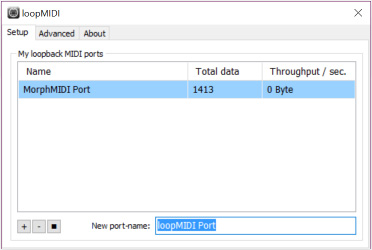

* connection between Morph bluetooth and "MorphMIDI Port" made in MIDIberry (just tap on an input port and an output port to connect them)


* virtual port "MorphMIDI Port" selected in the MIDI setup prefs of Bitwig Studio


* virtual port "MorphMIDI Port" selected in the MIDI setup prefs of FL Studio


##### iOS
iOS version 8 and above support Bluetooth MIDI. These devices have Bluetooth LE support:

* iPhone 4s +
* iPad3 +
* iPad Mini +

Once the Morph is paired with the iOS device, it's available as a MIDI device to most iOS MIDI-capable apps. You'll need to go into an app's preferences or setup panel to enable and configure MIDI control. 

In some cases, you may need the [midimittr app](https://itunes.apple.com/us/app/midimittr/id925495245?mt=8) to create a connection with the Morph which will expose the Morph's MIDI input to other apps.

##### Android
Android version [Marshmallow (6) and above](https://www.midi.org/articles/android-midi-in-marshmallow) support BLE MIDI. However, some devices support this connection type, and some don't. The best way to find out is to pair your device with the Morph via Bluetooth, then use the free [MIDI BLE Connect](https://play.google.com/store/apps/details?id=com.mobileer.example.midibtlepairing&hl=en) app from the Google Play store. Open it after paring the Morph to your Android device. If there is a connection to be found, MIDI BLE Connect will scan and find it.

TKTK - I have yet to confirm MIDI BLE on Android. I know it's possible, just haven't seen it.

##### Linux
BLE MIDI has some support in the latest [bluesz](http://www.bluez.org) stack, and should have more complete support in future updates according to [this blog](https://blog.felipetonello.com/2017/01/13/midi-over-bluetooth-low-energy-on-linux-finally-accepted/). You are welcome to experiment! Instructions for updating to the most recently release of bluesz are [above](#update-bluesz).

## Hardware
The Sensel Morph is a fairly simple piece of hardware. It consists of a flat rectangular area of force-sensing circuitry, a slightly raised area that contains additional processing circuitry, LEDs, a button, and micro USB connector.

### Features


### LEDS

#### Strip
There is a strip of 24 white LEDs. These light up when areas are pressed on the overlays, and can be controlled with the API.

#### Status RGB
This LED can be different colors indicating different things. The different colors and blink patterns are:

* _White_: Communication is happening to the device over USB
* _Blue stable_: The device is in bluetooth mode
* _Blue pulsing_: The device is in bluetooth pairing mode
* _Yellow_: The device is in update mode (this means you should open the Sensel App and update the firmware on your device)
* _Purple_: The device is communicating through the hacker cable (you won't see this unless you're using the hacker cable from the Innovator’s Kit)
* _Red_: Indicates a low battery or powering off device. To turn off the Morph, press and hold the power button for 5 seconds. After 2 seconds the red LED will turn on. Wait until the LED turns off before releasing the power button.

### Button
Use to power device on/off and put in Bluetooth pairing mode.

* Press to turn on
* Hold for a few seconds to put in pairing mode (blue LED)
* Hold for a few seconds to turn off (wait for red LED to go off)
* Double click to disconnect from current device and put Morph in pairing mode

### USB Connector
A single USB micro connector for charging the battery and providing a serial connection.

### Bluetooth Transmitter
The Morph can seamlessly switch between Bluetooth and wired operation. [Read on](#bluetooth-connection) for details on connecting to your device with Bluetooth

### Force Sensor Surface
Without an overlay, the Force Sensor Surface is mostly a black slab of nothing! However, you can get some life from it using the Visualizer in the SenselApp. It is no more or less durable than the rest of the case.

### Battery Life
The Morph has a built-in rechargeable 3.7 Volt Lithium Polymer battery rated at 420 mAh amp-hours. Under normal usage, you can expect six to eight hours of use from a fully charged battery.

### Care and Feeding

The overlays are made of silicone rubber with a silicone top-coating for a smooth feel. You can clean them with warm water and soap. While we have tested a variety of substances to ensure quality, it is known that some sunscreens and lotions can be contaminants on plastics. So, to ensure longest life for your overlays, keep your hands clean. Additionally, silicone is susceptible to tears. Once torn, it's difficult to stop. Use the handy case we provide to keep your overlays away from loose change, hairpins, keys, or other sharp items!

The LiPo battery's charge is handled by the Morph's internal electronics. However, a general rule-of-thumb for LiPo batteries is that they should not be stored at full charge. If you will not be using the Morph for a while, turn it on and let it charge down.

The black surface of the pressure sensor is PET (Polyethylene Terephthalate) plastic. This is a common and strong plastic. 

### Dimensions


Thickness measurements are with the rubber feet. Subtract 0.75 mm for thickness measurements without feet.

## Morph Dashboard Software
The Morph Dashboard is used to flash firmware, configure, calibrate, and confirm the functions of the Morph. You can download the software for Windows or macOS from the [Sensel website](http://sensel.com/start).

In order to use any of the features in the Morph Dashboard, you'll need to have a wired connection between your Morph and computer. A wireless connection is not sufficient for working with the Dashboard.

### Home
The home page of the Morph Dashboard allows you to select a task. You can edit the output of overlays, update firmware, and visualize the raw data from pressure input on the Morph.

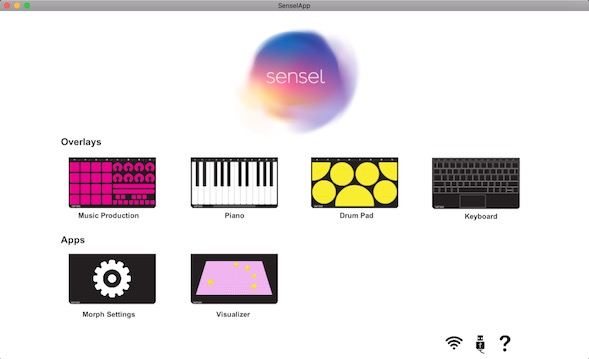

### Overlay Mapper

#### Music Overlays


The Production, Drum, and Piano overlays can be completely modified from their default settings, so they work exactly the way you want. When you select a music overlay from the Dashboard, you'll open a screen where you can click on the different buttons or regions to modify the MIDI notes sent from the pads. Use the inspector's menu to select a different note value for each pad you want to change. You can save the settings to a map preset. When finished editing, be sure to click "Send Map to Morph" to modify the settings.

#### QWERTY Overlay
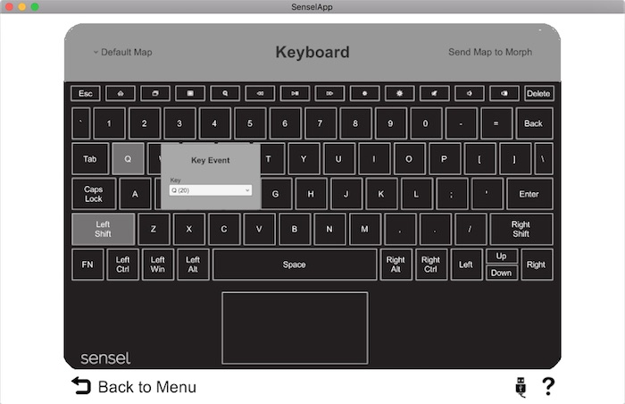

In one way, the mapper for the QWERTY overlay is very similar to the music editors. However, instead of modifying MIDI notes, you are modifying the key event codes from each stroke. A list of keyboard codes can be found at [this link.](https://en.wikipedia.org/wiki/ASCII#Code_chart)
More importantly, the QWERTY Overlay mapper allows you to set the operating system preference, which impacts how the control, option, command, and function keys will behave on the overlay. Use the menu to set your preference and click "Send to Morph".

### Visualizer
Use the Visualizer to view the raw pressure information coming from the Morph's sensor. The visualizer is more than entertaining, it's a look behind the scenes of what happens when you are using the Morph. You can see the effects of using different materials between a stylus (or some other actuator, like a finger) and pressure surface. You can also get a good impression of the dynamic range and sensitivity of the sensor. The curious and creative user will find great satisfaction in the Visualizer!

## Overlays

### QWERTY
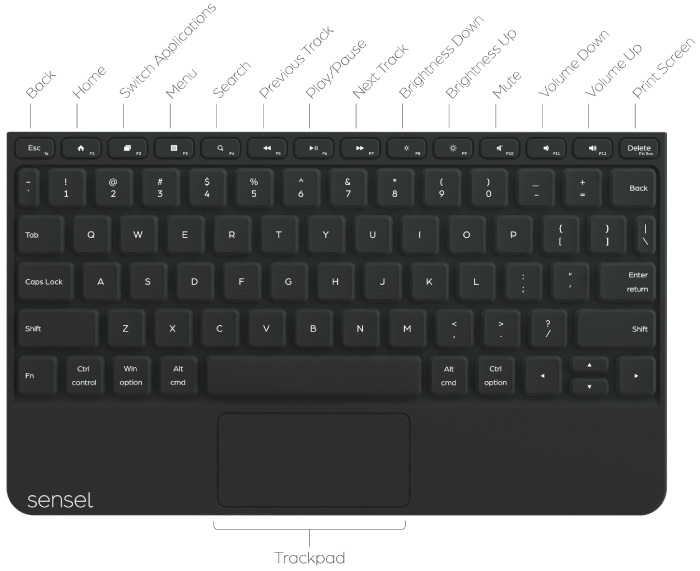

THe QWERTY Overlay works like a regular QWERTY keyboard. It's a nice option for using the Morph as a keyboard for a tablet or remote computer. You will need to configure for your Operating System using the Morph Dashboard.

### Piano


The Piano overlay sends MIDI data on Channel 1 from the Morph to your device so you can play software synths and samplers. By default, the Piano sends notes on MIDI channel 1 and the default octave starts at note 36 (C3). You can transpose up and down two octaves with the arrow keys. Additionally, you can create vibrato by moving your fingers side-to-side, bending the note.

The play, stop, and record buttons send MIDI Machine Control (MMC) commands to enable those features. Some software products, such as Ableton Live, do not recognize MMC, so they will seem to not work in those cases.

### Drums
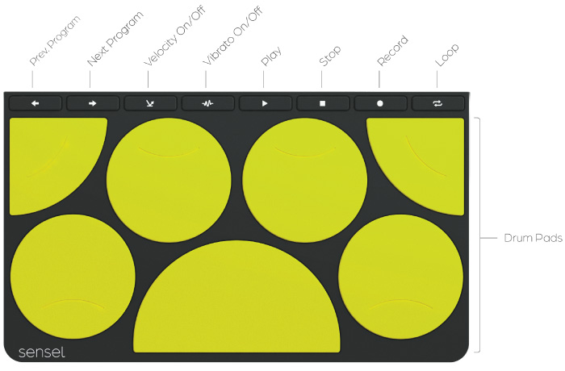

The Drum overlay sends notes on MIDI Channel 10. The Default notes start at 36 (C3). The arrow keys transpose all notes up or down 16 semitones to better work with many software drum machines, which work in banks of 16 notes.

The play, stop, and record buttons send MIDI Machine Control (MMC) commands to enable those features. Some software products, such as Ableton Live, do not recognize MMC, so they will seem to not work in those cases.

### Producer


The 16 Pad grid sends on MIDI Channel 2, the controls send on MIDI Channel 2, the "piano keys" send on MIDI Channel 3.

The play, stop, and record buttons send MIDI Machine Control (MMC) commands to enable those features. Some software products, such as Ableton Live, do not recognize MMC, so they will seem to not work in those cases.

### Gaming


The Gaming overlay is used for playing games.

### Media

The Media overlay is used for editing video and sound.

### Art


Use the Art overlay as a high-resolution drawing interface to capture the finest strokes with a variety of brushes and stylii.

### Innovator


Your turn to make an overlay! The Innovator kit works with the API.

## Use it!
As the name implies, there are a lot of different ways to use the high-resolution sensor that is the Morph. What follows in this section are the nuts and bolts on getting your morph working with your device and making use of the different overlays in different softwares.

### Test it!
Because the Morph is capable of so many different modes and protocols, you may need some reassurance and ways of testing. Here's some tools and suggestions for some of the different modes.

#### MIDI
If you are unsure that your Morph is properly connected and providing MIDI input to your computer, you can test with some simple programs. If you don't know what MIDI is, it's a simple serial protocol that electronic music hardware and software uses to interoperate. Learn more [at wikipedia](https://en.wikipedia.org/wiki/MIDI).

##### OS X
* [MIDI Monitor](https://www.snoize.com/MIDIMonitor/)

##### Windows
* [MIDIberry](https://www.microsoft.com/en-us/store/p/midiberry/9n39720h2m05)

Bluetooth MIDI is available on Windows 10 Anniversary Edition, so make sure your version of Windows 10 is recently updated. It is limited to apps that use the native Windows MIDI implementation, so it probably won't show up as a MIDI input in most software.

MIDIberry provides native MIDI hooks to Windows 10, so it can connect to the USB MIDI and the Bluetooth MIDI ports created by the Morph. MIDIberry provides a monitor function that makes it easy to confirm MIDI data input from the Morph.

##### iOS
* [MIDI Wrench](https://www.crudebyte.com/mobile/midi_wrench/)

##### Android
* [USB MIDI Monitor](https://play.google.com/store/apps/details?id=com.extreamsd.usbmidimonitor&hl=en)

##### Linux
* [amidi](https://linux.die.net/man/1/amidi)
* [others](https://freesoftwaremusic.wordpress.com/2015/03/29/midi-monitors/comment-page-1/)

If you want a GUI monitor, you can find something in the "others" link above. 
The easiest way to test on Linux is to use ALSA's `amidi` in a terminal. Plug in the Morph to your computer's USB port, then list the MIDI devices with: 
```
amidi -l
```
You'll get something like 
```
Dir	Device		Name
IO	hw:1,0,0 	Sensel Morph MIDI 1
```
Armed with the portname, you can now start dumping MIDI input to the terminal:
```
amidi -d -p hw:1,0,0
```

#### QWERTY
Open text editor or word processing program. Try typing. Use command and option keys. Everything work? If not, you'll need to either check your connection, or use the Morph Dashboard to make sure your QWERTY overlay is configured for your OS.

### Music Software Guides
For the most part, when the Morph is used as a MIDI device, it shows up like any other MIDI keyboard or controller. However, there are some details worth documenting, since, with default mappings, each overlay sends on a different channel. Before you proceed make sure you have a wired or wireless connection between your device and the Morph.

The below screenshots show the Morph used as a Bluetooth MIDI device, but the general instructions do not change for the wired case or for different operating systems.

#### Ableton Live


Open the Preferences window in Ableton Live and select the MIDI tab. If you just want to play the keyboard and drums, turn "Track" on for the input port. If you want to use controls and buttons for parameters and switches in Live, turn "Remote" on for the input port. At this time, there is no MIDI control of the Morph, so there is no need to activate "Track" or "Remote" for output.

In Ableton Live, you can filter MIDI input on tracks according to Channel. You may want to do this to ensure different overlays are dedicated to different tracks.

#### Bitwig Studio


Open the Preferences window in Bitwig Studio and select the Settings, then Controllers tabs. Select "Generic" (though the Morph is anything but generic!), then choose either "MIDI Keyboard" or "Keyboard + 8 Device Knobs".

The *MIDI Keyboard* option makes it easy to play notes in any of the instruments. If you want to map the extra CC controls of the Producer overlay to different parameters in Bitwig, you can use Bitwig's MIDI learn feature in the Mappings Browser Panel.

The *Keyboard + 8 Device Knobs* will make the Producer overlay nicer to work with. You can use the Morph Dashboard to remap the knobs to CC values 20-27, and Bitwig will automatically map the eight knobs to the currently selected Device Macros.

In this setup, both options have been added as Controllers, though only one is active.
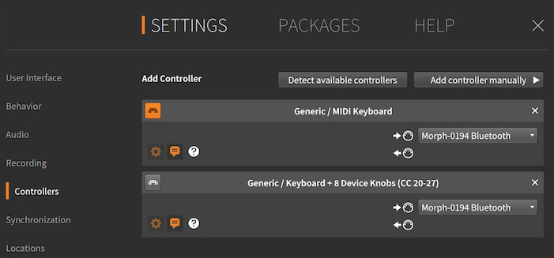

Note that it is not possible to filter MIDI Channels in Bitwig tracks. If you want to do more advanced filtering and controls, you can use Bitwig's Controller Scripting API and create a control script.

#### FL Studio
FL Studio is Windows-only, with a macOS alpha in the works.


Open the MIDI Settings window from the Options menu.

Select the Morph in the input panel. 

Click "enable" below the Input panel. Select a controller type "(generic controller)" from the menu.

This enables basic MIDI input for the Morph. You can get more info on using MIDI in FL Studio 12 from their documentation.

#### Cycling 74 Max
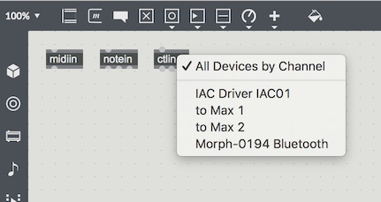

Max will use any active MIDI device as an input. How you program your patch will affect what happens. The above screenshot illustrates the MIDI input selection menu that appears from double clicking on the MIDI input objects (midiin, ctlin, notein, pgmin, etc.).

#### Apple Logic Pro X, Garage Band, and Main Stage


With Apple music applications, "it just works" is the general idea. If it shows up in AudioMIDI Setup, it will provide input to recording-armed tracks to play software synths, samplers, and drums.

If you want to add more controls for effects and synths, you can use Logic's "Learn Controls" features.


You may need to edit some values in the Expert View, since sometimes Logic will guess incorrectly about the format of incoming data. The procedure is similar for Main Stage.

Garage Band offers no remote control of parameters from MIDI devices. You can only play instruments with note and pitchbend input.

#### Presonus StudioOne 2
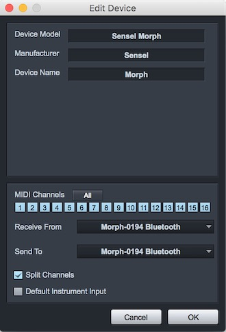

Open the Presonus preferences panel and select the *External Devices* tab. Press the _"Add..."_ button to add a new MIDI controller.

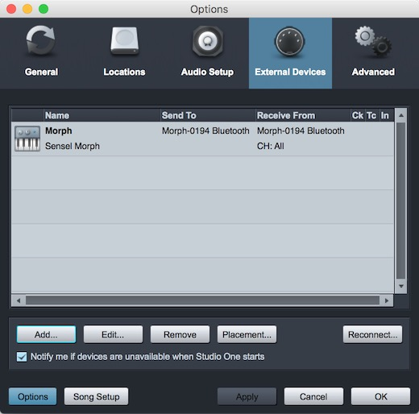

In the resulting *Edit Device* panel, you can add "Sensel" to the Manufacturer field and "Morph" to "Device Name" field. Press the _All_ button to receive MIDI on all channels. Select the Morph in the "Receive From" menu (there is no need to select the Morph in the Send To menu, since there is currently no MIDI control of the Morph).

Engage "Split Channels" if you would like to create a separate Instrument Track input for each MIDI channel from the Keyboard. You will probably want to enable Split Channels as pictured, since each overlay sends on a different MIDI channel.

You can choose to use this Keyboard as your "Default Instrument Input" by checking the appropriate box. If you are using only one Keyboard with Studio One, you should check this box.

#### Propellerheads Reason
Reason has several ways of using a MIDI keyboard or controller. The most basic is to just add the Morph as a keyboard.


Open Reason's Preferences panel, and select the *Control Surfaces* tab. Click the _Add_ button, and select the "<Other>" from the *Manufacturer* menu and "MIDI Control Keyboard" from the *Model* menu. You can type "Sensel Morph" into the *Name* field. Finally, select the Morph from the *MIDI Input* menu.


After you have set that up, you can make a more sophisticated setup to filter channels


Select the "Sync" tab and add the Sensel Morph to at least one of the External Control Buses, as pictured above.

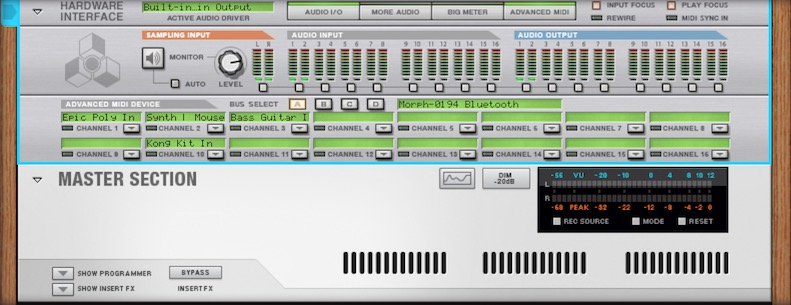

Now you can use the Hardware device in the Reason Rack and click the *ADVANCED MIDI* button to expose the selectors. It is here that you can map MIDI channels (and thereby different overlays) from the Morph to different devcies in your rack.

#### Other Programs
These programs are worth investigating, since they are popular.
##### Ardour (linux)
##### Hydrogen (linux)
##### Reaper
##### ProTools
##### Kontakt
##### Massive
##### Maschine
Although Maschine comes with its own hardware for sequencing and playing drums, you may want to use the highly-sensitive and playable surface of the Morph to play the extensive soundbanks and effects in the Maschine software.
###### Standalone
###### VST

##### Traktor
You can use the reliable Morph to trigger samples and control effects in Tracktor, but you'll need to design your own Control Surface Setup to make it do what you want to do. This is not a complete tutorial on creating a setup in Traktor, but is designed to get you started with mapping the Morph to Traktor. (hint: use the Sensel Mapper software to mimic the MIDI output from another similar controller, then use that Setup.)

### Drawing and Painting
### Media Editing
### Gaming
### QWERTY

### Inventing

## API
There's a software API for Python and C/C++. Find out more [at our github](http://github.com/sensel)
