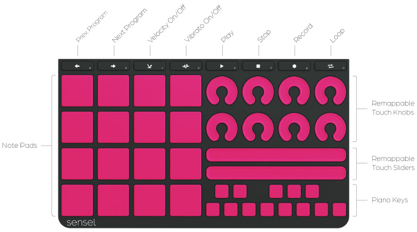
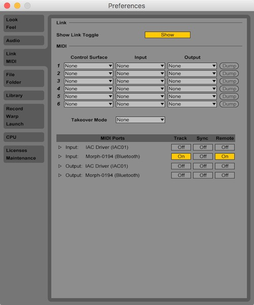
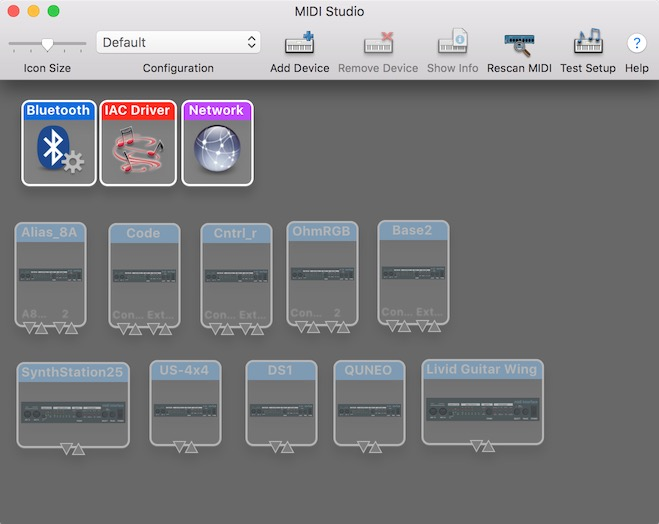
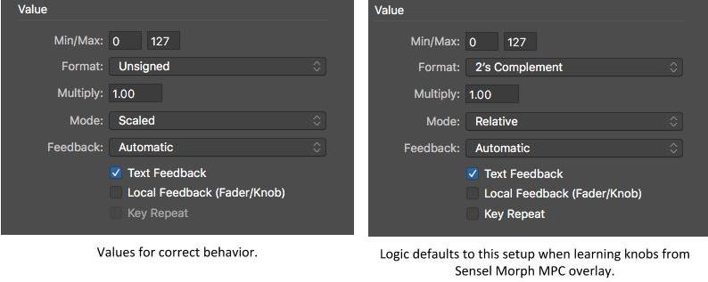

# Welcome
This documentation explains what makes up the Sensel Morph and how to use it.
## Overview - What is Morph
The Sensel Morph is a reconfigurable control surface for artists, musicians, coders, and creative people of all stripes. It can work using Bluetooth 4.0LE connection or USB.
## What's in the box

* Morph
* 3ft. USB Micro Cable
* Carrying case
* Overlays
* Quickstart guide

## Supported Operating systems

| Operating system | USB MIDI | Bluetooth LE MIDI | SenselApp |
| -----------------|----------------|----------|-----------|
| OS X 10.10 + | Yes | Yes | Yes |
| macOS 10.12 + |  Yes | Yes | Yes |
| Windows XP, 7, and 8 | Yes | Yes | Yes |
| Windows 10 Anniversary Edition | Yes | Yes | Yes |
| Ubuntu/Debian-based Linux[1](#fn1) | Yes | [Soon](https://blog.felipetonello.com/2017/01/13/midi-over-bluetooth-low-energy-on-linux-finally-accepted/) | No |
| Android | Yes | Yes[2](#fn2) | No |
| iOS | Yes | Yes | No |

<a name="fn1">1</a> - Many linux distributions will support USB MIDI. Only distributions that use the bluesz stack will support BLE MIDI.
<a name="fn2">2</a> - Supported in Android Marshmallow and up

## Quick Start
This guide will get your Morph out of the box and working with your computer or mobile device.
### 1 Download Software
Download the SenselApp mapping and configuration application from [the Sensel website.](http://sensel.com/start) This is not only a great tool for getting the most out of your Morph, but essential for updating its firmware.
### 2 Wired connection
Remove the Morph and the supplied USB Micro cable from the box.
Connect the Morph to your Windows or MacOS computer with the USB cable.
The Morph will power up and automatically connect to your operating system.
### 3 Update Firmware
Make sure you have a reliable internet connection and launch the SenselApp on your computer with the Morph connected. The application will query our servers and find if there is a firmware update available. If there is, update your firmware and continue.
### 4 Launch the Visualizer
The Visualizer is the easiest way to see activity on your Morph and confirm the hardware is communicating with your computer.

### Bluetooth connection
This section describes how to pair and un-pair your Morph to a bluetooth connection on a number of operating systems. Include flow chart of connection states?
#### OSX
System Preferences, bluetooth. Pairing and successful pairing.
#### Windows
TBD
#### iOS
System Prefs bluetooth.
#### Android
TBD
#### Linux
TBD. Depends on the distro, really. Probably just document Ubuntu 16?

#### Bluetooth MIDI configuration
If your operating system supports MIDI over Bluetooth, you can have a wireless MIDI controller.
##### OSX
Screenshot of AudioMIDI MIDI window, showing Bluetooth MIDI connection

Open the AudioMIDI application in macOS. Open the MIDI Studio window (cmd-2) and double-click the Bluetooth logo. If you have successfully paired the Morph with Bluetooth, you'll see your device listed here. Press "connect" and the Morph will be available to any MIDI applications as an input device.

##### Windows
Windows 10 Anniversary Edition and after support Bluetooth MIDI.
##### iOS
Some apps will be able to natively recognize Bluetooth MIDI connections. However, for general use, we recommend the the [midimittr app](https://itunes.apple.com/us/app/midimittr/id925495245?mt=8) to create a connection with the Morph and direct MIDI data to iOS MIDI applications.
##### Android
Need Android device to test and document. [Marshmallow and above](https://www.midi.org/articles/android-midi-in-marshmallow) support BLE MIDI.
##### Linux
Appears it's on the horizon according to [this blog](https://blog.felipetonello.com/2017/01/13/midi-over-bluetooth-low-energy-on-linux-finally-accepted/)

## Hardware
The Sensel Morph is a fairly simple piece of hardware. It consists of a flat rectangular area of force-sensing circuitry, a slightly raised area that contains additional processing circuitry, LEDs, a button, and micro USB connector.
### Features

### LEDS
#### bar
There is a bar of <N> white LEDs. These light up at different times and can be controlled somehow.
#### single rgb
This LED can be different colors indicating different things. The different colors and blink patterns are:

* _White_: Communication is happening to the device over USB
* _Blue stable_: The device is in bluetooth mode
* _Blue pulsing_: The device is in bluetooth pairing mode
* _Yellow_: The device is in factory mode (this means you should open the Sensel App and update the firmware on your device)
* _Purple_: The device is communicating through the hacker cable (you won't see this unless you're using the hacker cable from the Innovator’s Kit)
* _Red_: Indicates a low battery or powering off device. To turn off the Morph, press and hold the power button for 5 seconds. After 2 seconds the red LED will turn on. Wait until the LED turns off before releasing the power button.

### Button
Use to power device on/off and put in Bluetooth pairing mode.
### Connector
A single USB micro connector for charging the battery and providing a serial connection.
### Force Sensor Surface
Things to know. Doesn't do anything without an Overlay.
### Care and Feeding
Use these types of cleaners. Don't put it underwater. Temperature ranges. Touching the surface vs. using media on the surface.
### Dimensions

## Morph Dashboard Software
The Morph Dashboard is used to flash firmware, configure, calibrate, and confirm the functions of the Morph. You can download the software for Windows or macOS from the [Sensel website](http://sensel.com/start).

In order to use any of the features in the Morph Dashboard, you'll need to have a wired connection between your Morph and computer. A wireless connection is not sufficient for working with the Dashboard.

### Home
The home page of the Morph Dashboard allows you to select a task. You can edit the output of overlays, update firmware, and visualize the raw data from pressure input on the Morph.

### Overlay Mapper
#### Music Overlays

The Production, Drum, and Piano overlays can be completely modified from their default settings, so they work exactly the way you want. When you select a music overlay from the Dashboard, you'll open a screen where you can click on the different buttons or regions to modify the MIDI notes sent from the pads. Use the inspector's menu to select a different note value for each pad you want to change. You can save the settings to a map preset. When finished editing, be sure to click "Send Map to Morph" to modify the settings.
#### QWERTY Overlay

In one way, the mapper for the QWERTY overlay is very similar to the music editors. However, instead of modifying MIDI notes, you are modifying the key event codes from each stroke. A list of keyboard codes can be found at [this link.](https://en.wikipedia.org/wiki/ASCII#Code_chart)
More importantly, the QWERTY Overlay mapper allows you to set the operating system preference, which impacts how the control, option, command, and function keys will behave on the overlay. Use the menu to set your preference and click "Send to Morph".
### Visualizer
Use the Visualizer to view the raw pressure information coming from the Morph's sensor. The visualizer is more than entertaining, it's a look behind the scenes of what happens when you are using the Morph. You can see the effects of using different materials between a stylus (or some other actuator, like a finger) and pressure surface. You can also get a good impression of the dynamic range and sensitivity of the sensor. The curious and creative user will find great satisfaction in the Visualizer!

## Overlays
### QWERTY

THe QWERTY Overlay works like a regular QWERTY keyboard. It's a nice option for using the Morph as a keyboard for a tablet or remote computer. You will need to configure for your Operating System using the Morph Dashboard.
### Piano

The Piano overlay sends MIDI data from the Morph to your device so you can play software synths and samplers. By default, the Piano sends notes on MIDI channel 1 and the default octave starts at note 36 (C3). Additionally, you can create vibrato by moving your
### Drums

Sends on MIDI Channel 10. Default note assignments are... Uses high speed sampling so it can be used with hands or with sticks.
### Producer

The 16 Pad grid sends on MIDI Channel 2, the controls send on MIDI Channel 2, the "piano keys" send on MIDI Channel 3.
### Gaming

Works like a bluetooth gaming controller.
### Media

Used to edit video.
### Art

Use as a high-resolution drawing interface to capture the finest strokes with a variety of brushes and stylii.
### Innovator

Your turn to make an overlay! The Innovator kit works with the API.

## Use it!
As the name implies, there are a lot of different ways to use the high-resolution sensor that is the Morph. What follows in this section are the nuts and bolts on getting your morph working with your device and making use of the different overlays in different softwares.

### Test it!
If you are unsure that your Morph is properly connected and providing MIDI input to your computer, you can test with some simple programs.
#### OS X
* [MIDI Monitor](https://www.snoize.com/MIDIMonitor/)

#### Windows
* [MIDI Monitor](http://obds.free.fr/midimon/)
* [MIDI OX](http://www.midiox.com/)

Both of the above applications will take you back in time, but they work!
#### iOS
* [MIDI Wrench](https://www.crudebyte.com/mobile/midi_wrench/)

#### Android
* [USB MIDI Monitor](https://play.google.com/store/apps/details?id=com.extreamsd.usbmidimonitor&hl=en)

#### Linux
* [KMidimon](http://kmidimon.sourceforge.net/)
* [amidi](https://linux.die.net/man/1/amidi)
* [others](https://freesoftwaremusic.wordpress.com/2015/03/29/midi-monitors/comment-page-1/)

### Music Software Guides
For the most part, when the Morph is used as a MIDI device, it shows up like any other MIDI keyboard or controller. However, there are some details worth documenting, since, with default mappings, each overlay sends on a different channel. Before you proceed make sure you have a wired or wireless connection between your device and the Morph.
#### Ableton Live

#### Bitwig Studio

#### FL Studio
FL Studio is Windows-only, with a macOS alpha in the works.
#### Cycling 74 Max

#### Apple Logic Pro X, Garage Band, and Main Stage

With Apple music applications, "it just works" is the general idea. If it shows up in AudioMIDI Setup, it will provide input to recording-armed tracks to play software synths, samplers, and drums.

If you want to add more controls for effects and synths, you can use Logic's "Learn Controls" features.

You may need to edit some values in the Expert View, since sometimes Logic will guess incorrectly about the format of incoming data. The procedure is similar for Main Stage.

Garage Band offers no remote control of parameters from MIDI devices. You can only play instruments with note and pitchbend input.

#### Presonus StudioOne 2

Engage Split Channels if you would like to create a separate Instrument Track input for each MIDI channel from the Keyboard. You will probably want to enable Split Channels as pictured, since each overlay sends on a different MIDI channel.

You can choose to use this Keyboard as your Default Instrument Input by checking the appropriate box. If you are using only one Keyboard with Studio One, you should check this box.

#### Propellerheads Reason

#### Other Programs
These programs are worth investigating, since they are popular.
##### Ardour
##### Reaper
##### ProTools
##### Kontakt
##### Massive
##### Maschine
Although Maschine comes with its own hardware for sequencing and playing drums, you may want to use the highly-sensitive and playable surface of the Morph to play the extensive soundbanks and effects in the Maschine software.
###### Standalone
###### VST

##### Traktor
You can use the reliable Morph to trigger samples and control effects in Tracktor, but you'll need to design your own Control Surface Setup to make it do what you want to do. This is not a complete tutorial on creating a setup in Traktor, but is designed to get you started with mapping the Morph to Traktor. (hint: use the Sensel Mapper software to mimic the MIDI output from another similar controller, then use that Setup.)

### Drawing and Painting
### Media Editing
### Gaming
### QWERTY

### Inventing

## API
There's a software API for Python and C/C++. Find out more [at our github](http://github.com/sensel)
